## Air Sensor test - 19 unit analysis

This test was the first try to evaluate performance in a dusty environment, which rather failed but produced some interesting results, see below for details.

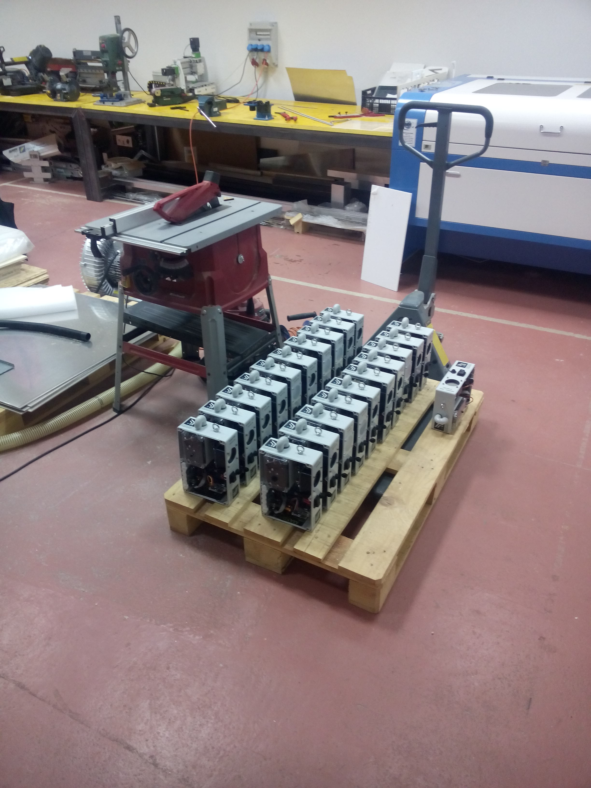

The units were stacked in the machine workshop with a large vacuum pump running between 0 and 4 hours period on these graphs and lifting lots of dust in the air.

Timeline:
 * 0-4h - pump running and dust circulating
 * around 4h - additional dust added to the pump to disperse
 * around 4h - pump turned off
 * after 4h - pump turned off and space closed without any movement for settling period.

One unit was mis-behaving during the experient, with pink colored data.

## Battery status
The following graphs show battery charge percentage (%), current (mA) and voltage results (V) on units of time in hours. We can see a reasonably similar discharge on all units but one, that requires servicing.

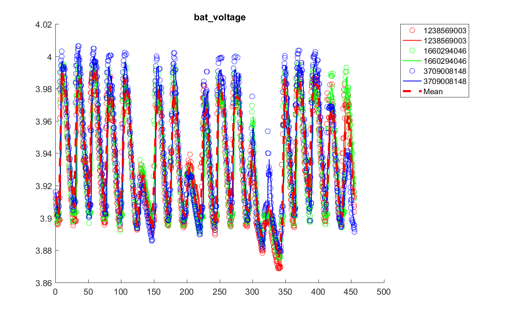

## Pressure, temperature and humidity
The following graphs show relative humidity (%), pressure (mbar) and temperature (deg C). We can observe that during the first part of the experiment when teh fan was running, humidity measurements are significantly different between units, but later stabilize in steady air.

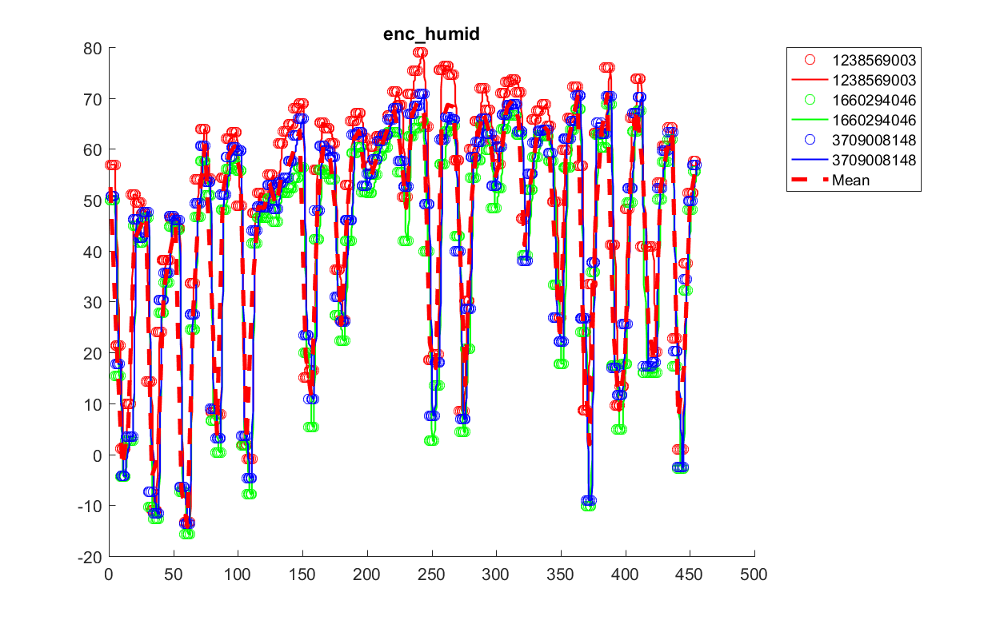

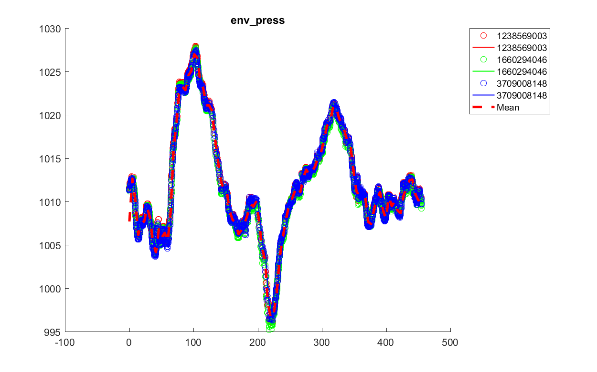

## Radiation
Radiation measurements are observed for any significant out of range values, we observe only the background radiation with a rather random pattern between units, ranging between 25 and 33 cpm for the compensated tube and 23 to 36 cpm for uncompensated.

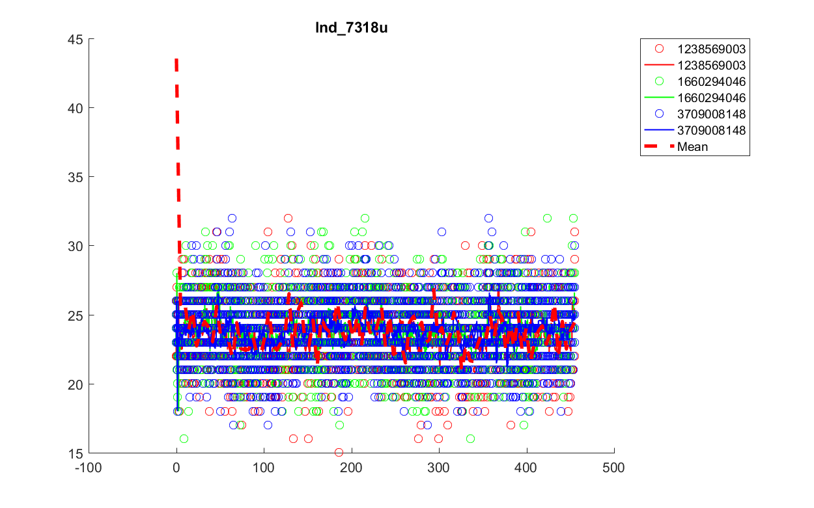

## OPC Air sensor PM values
Alpnasense OPC-N2 sensors return values of PM1, PM2.5 and PM10 counts in ug/m3 concentration. We can see spikes during different times for different particle sizes, somewhat correlated to human intervention and introducing some extra dust around the 4 hour mark

## PMS Air sensor PM values
APMS sensors returns values of PM1, PM2.5 and PM10 counts in ug/m3 concentration. We observe that PMS sensors measure concentration in more discrete levels and genrally agree with OPC measurements, except around the 4 hour mark, when there was a high increase in large particles, recognized by OPC, but that significantly PMS.

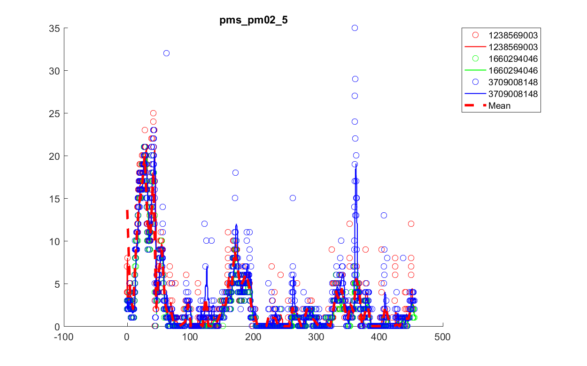

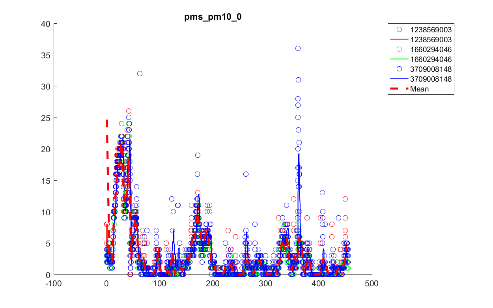

## OPC Air sensor raw bin count values
These raw bin count values are graphed for convenience of analysis.

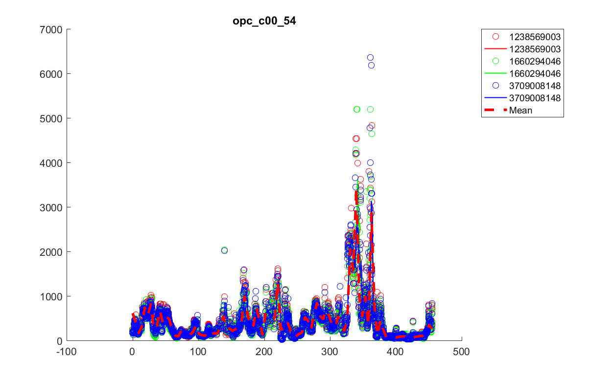

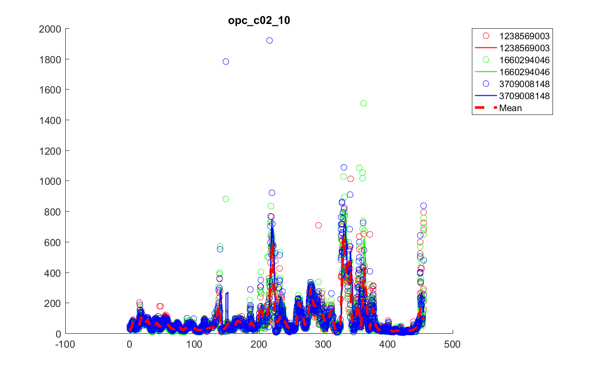

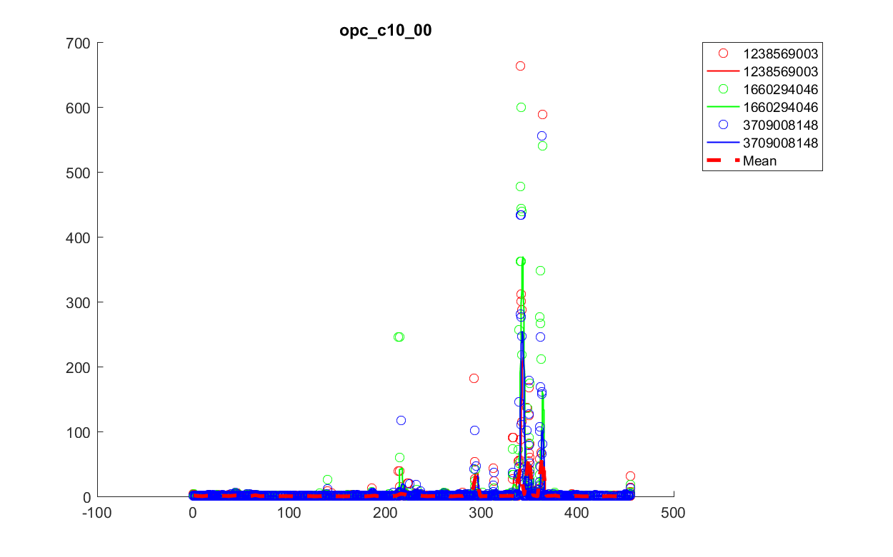

## PMS Air sensor raw bin count values
These raw bin count values are graphed for convenience of analysis.

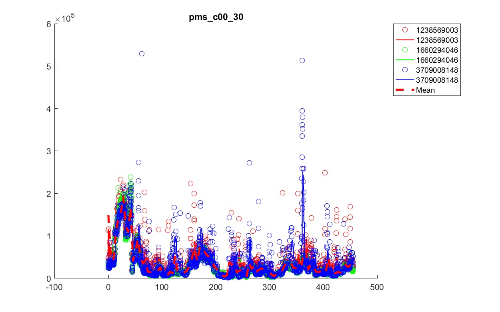

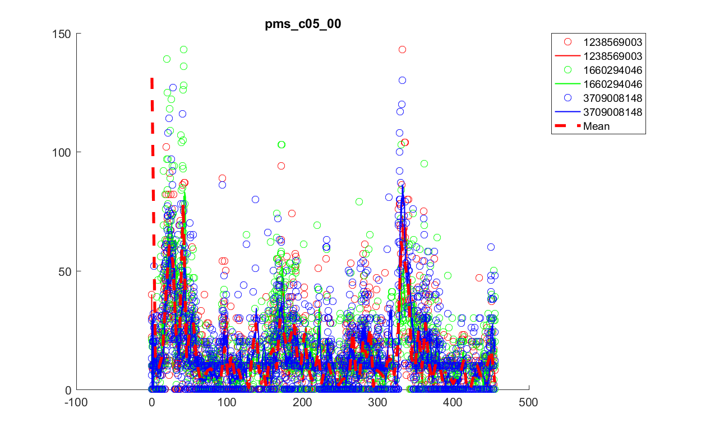

